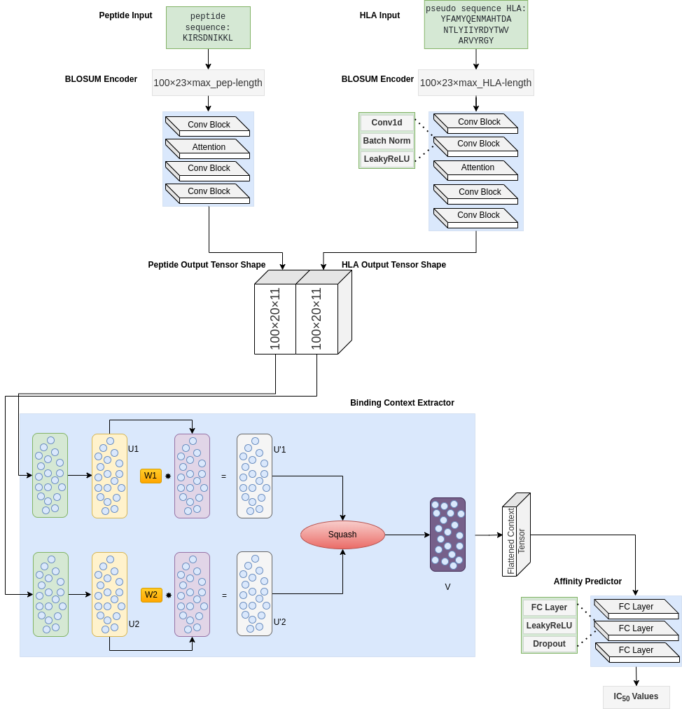

#  CapsNet-MHC: 

### Deep learning prediction of MHC-I peptide binding with Capsule Networks

### Introduction

There is two type of codes and dataset directory:
- Anthem_codes and Anthme_dataset are develop for training and test based on Anthem data
- IEDB_codes and IEDB_dataset are develop for training and test based on IEDB data
 

### Testing: 

- For Anthem data in Anthem_codes our final ensemble prediction model is stored in the "Anthem_test" folder, suppose now we want to output testing results of the final model in "Anthem_test".

  1) In the file "Anthem_test/config.json", the "test_file" refers to the file name of the testing set. All the testing files also need to be stored in the folder "Anthem_dataset". In the folder "Anthem_dataset", the "test_data.txt" is the testing set we used to compare our results with other IEDB benchmark algorithms.  
  2) Back to the directory "Anthem_codes". Run in the command line: 
  "python test.py Anthem_test/config.json". After the testing process finishing, the testing results will be output to "Anthem_test", which are "weekly_result.txt" in detail, we uses this file in "Metrics_Calculator.ipynb" and extract all of our result figures. 

- For IEDB data in IEDB_codes our final ensemble prediction model is stored in the "IEDB_test" folder, suppose now we want to output testing results of the final model in "IEDB_test".

  1) In the file "IEDB_test/config.json", the "test_file" refers to the file name of the testing set. All the testing files also need to be stored in the folder "IEDB_dataset". In the folder "IEDB_dataset", the "testing_set.txt" is the testing set we used to compare our results with other IEDB benchmark algorithms.  
  2) Back to the directory "IEDB_codes". Run in the command line: 
  "python test.py IEDB_test/config.json". After the testing process finishing, the testing results will be output to "IEDB_test", which are "weekly_result.txt" in detail and "weekly_result_METRICS.txt" for final comparison results.
### Training: 
- For Anthem data:
    1) Build a new folder "Anthem_train" inside the folder 'Anthem_codes'. "Anthem_train" will be the folder where the algorithm reads the file storing parameters and outputs the trained models.  
    2) Copy the "config.json" in "Anthem_codes/Anthem_test" to "Anthem_train". "config.json" is the file storing useful parameters and the source paths of input data. 
    3) In the file "config.json", change the content of attribute "working_dir" to be "Anthem_train". You are free to change other parameters to test the effects. The "data_file" refers to the file name of the training set, e.g, "train_data.txt". All the data files should be stored in the folder "Anthem_dataset". 
    4) Back to the directory "Anthem_codes". Run in the command line:  
    "python train.py Anthem_train/config.json". After the training process finishing, the networks will be output to "Anthem_train". 

- For IEDB data:
    1) Build a new folder "IEDB_train" inside the folder 'IEDB_codes'. "IEDB_train" will be the folder where the algorithm reads the file storing parameters and outputs the trained models.  
    2) Copy the "config.json" in "IEDB_codes/IEDB_test" to "IEDB_train". "config.json" is the file storing useful parameters and the source paths of input data. 
    3) In the file "config.json", change the content of attribute "working_dir" to be "IEDB_train". You are free to change other parameters to test the effects. The "data_file" refers to the file name of the training set, e.g, "training_set.txt". All the data files should be stored in the folder "IEDB_dataset". 
    4) Back to the directory "IEDB_codes". Run in the command line:  
    "python train.py IEDB_train/config.json". After the training process finishing, the networks will be output to "IEDB_train".

